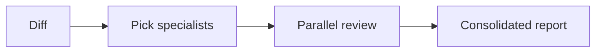

# empire-dev

Development collaboration: parallel specialist code review, pre-implementation diagnostics (requirements, design, architecture, task breakdown, cognitive audit), plus a bundled roster of dev subagents.

Part of the [empire](../../README.md) marketplace.

## Install

```sh
/plugin marketplace add marcoskichel/empire
/plugin install empire-dev@empire
```

Or install the full empire bundle (which includes this plugin):

```sh
/plugin install empire@empire
```

## Skills

### `team-review`

Spawn parallel specialist subagents to review a diff or PR, then consolidate findings into a single deduplicated report. The skill detects signals in the diff (language, security surface, architectural change, perf hotspots, tests), picks 3–6 specialists from the available roster, dispatches them in parallel, and merges their findings into a prioritized must-fix / should-fix / nits list. Findings stay local — never posted to GitHub.

**Triggers (strong, dispatch immediately):** "team review", "specialist review", "have specialists review", "ask the team", "parallel review", "have the team look", "re-review", "another pass".

**Triggers (weak, skill confirms before dispatch):** "review my changes", "review again", "look at this".



**Source:** [`skills/team-review/SKILL.md`](skills/team-review/SKILL.md)

### `probe`

Diagnose thinking failures and audit whether reasoning serves inquiry or defense. Two modes: self-monitoring (agent audits own reasoning) and user coaching (diagnose thinking pattern with questions, not declarations). Covers eight failure states from no orientation awareness through Monitor co-option — where the self-corrective machinery actively defends wrong conclusions. Findings stay local.

**Triggers:** "check my thinking", "am I reasoning well", "why am I stuck", "reasoning feels circular", "probe my logic", "conclusion feels defended", "/empire-dev:probe".

**Source:** [`skills/probe/SKILL.md`](skills/probe/SKILL.md)

### `weigh`

Systematically evaluate architecture decisions, document trade-offs, and select appropriate patterns for context. Generates weighted decision matrices, ADRs, and applies refactoring patterns (Branch by Abstraction, Strangler Fig, Parallel Run). Findings stay local.

**Triggers:** "architecture decision", "ADR", "which pattern should I use", "evaluate trade-offs", "technology choice", "design pattern selection", "weigh the options", "/empire-dev:weigh".

**Source:** [`skills/weigh/SKILL.md`](skills/weigh/SKILL.md)

### `shape`

Diagnose system design problems across seven states — from no requirements clarity through validated design with walking skeleton defined. Prevents over-engineering and under-engineering; surfaces missing integration points; drives toward a thin end-to-end path before full build-out. Findings stay local.

**Triggers:** "system design", "how should I structure this", "too much abstraction", "under-engineered", "where do I start building", "design this system", "walking skeleton", "/empire-dev:shape".

**Source:** [`skills/shape/SKILL.md`](skills/shape/SKILL.md)

### `distill`

Diagnose requirements problems across six states — from no problem statement through validated requirements ready for design. Distinguishes problem from solution, surfaces hidden constraints, and bounds scope to a viable V1. Pairs with `shape` as the upstream handoff. Findings stay local.

**Triggers:** "requirements analysis", "what should I build", "clarify requirements", "is this the right problem", "define scope", "distill requirements", "/empire-dev:distill".

**Source:** [`skills/distill/SKILL.md`](skills/distill/SKILL.md)

### `slice`

Transform overwhelming development tasks into manageable, independently deliverable units. Diagnoses six failure states (too big, no entry point, dependency tangles, no done criteria, scope creep, spike needed) and applies decomposition patterns: vertical slicing, walking skeleton, tracer bullet. Includes Fibonacci sizing and three-point estimation.

**Triggers:** "task too big", "can't estimate", "overwhelmed by scope", "where do I start", "break this down", "epic needs breakdown", "slice this up", "/empire-dev:slice".

**Source:** [`skills/slice/SKILL.md`](skills/slice/SKILL.md)

## Bundled agents

Code review:

| Agent                  | Use                                              |
| ---------------------- | ------------------------------------------------ |
| `code-reviewer`        | Generalist code review (security, perf, quality) |
| `debugger`             | Root-cause analysis of errors and test failures  |
| `test-automator`       | Test strategy, frameworks, TDD, CI quality gates |
| `security-auditor`     | Auth, crypto, OWASP, threat modeling, compliance |
| `architect-review`     | Clean architecture, microservices, DDD, SOLID    |
| `performance-engineer` | Profiling, bottlenecks, caching, observability   |

Paradigm specialists:

| Agent                           | Use                                                       |
| ------------------------------- | --------------------------------------------------------- |
| `functional-programming-expert` | Purity, immutability, totality, composition, ADT modeling |
| `concurrency-reviewer`          | Race conditions, deadlocks, async / await correctness     |
| `type-system-expert`            | Type design, invariants, generics, GADTs, branded types   |

Domain experts:

| Agent                  | Use                                                  |
| ---------------------- | ---------------------------------------------------- |
| `blockchain-developer` | Smart contracts, DeFi, Web3, gas optimization, audit |
| `ai-engineer`          | LLM apps, RAG, agents, prompts, vector search        |

The `team-review` skill auto-discovers whatever specialist subagents are installed and picks the best match per task. If your environment has more specialized subagents from another marketplace, the skill will use them.

## Upstream attribution

- Bundled agents: [`agents/NOTICE.md`](agents/NOTICE.md)
- Bundled skills: [`skills/NOTICE.md`](skills/NOTICE.md)
