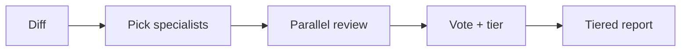
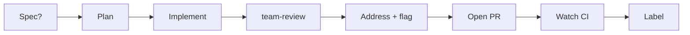

# empire-dev

Development collaboration: parallel specialist code review, pre-implementation diagnostics (design, architecture, task breakdown), plus a bundled roster of dev subagents.

Part of the [empire](../../README.md) marketplace.

## Install

```sh
/plugin marketplace add marcoskichel/empire
/plugin install empire-dev@empire
```

Or install the full empire bundle (which includes this plugin):

```sh
/plugin install empire@empire
```

## Skills

### `team-review`

Spawn parallel specialist subagents to review a diff or PR, then aggregate findings into a tiered consensus report (Consensus / Corroborated / Single-source). The skill detects signals in the diff (language, security surface, architectural change, perf hotspots, tests), picks 3–6 specialists from the available roster, dispatches them in parallel, then votes findings by `(file, line-range, category)` match — surfacing high-confidence issues first while preserving every specialist's input. Reads `CONTEXT.md` and relevant `docs/adr/` entries before dispatch, passing project vocabulary to each specialist. Findings stay local — never posted to GitHub.

**Triggers (strong, dispatch immediately):** "team review", "specialist review", "have specialists review", "ask the team", "parallel review", "have the team look", "re-review", "another pass".

**Triggers (weak, skill confirms before dispatch):** "review my changes", "review again", "look at this".



**Source:** [`skills/team-review/SKILL.md`](skills/team-review/SKILL.md)

### `socratic-pr-review`

Review a PR in the Socratic style: lead the author to each defect with a question instead of dictating the fix. Runs `team-review` on the PR, converts its recommended actions into short question-style inline comments, re-checks every comment against the current code (with optional web research), then walks them past you one at a time to keep, adjust, or drop. After validation it proposes a verdict (approve / request changes / comment) plus an optional summary, and on your approval posts the entire review in a single GitHub API call. This is the one empire-dev skill that writes to GitHub, and only after you validate every comment and the verdict. Comments stay short (ideally under 150 chars), omit fix suggestions unless unambiguous, and use no dashes or emojis.

**Triggers:** "socratic review", "socratic pr review", "socratic code review", "review this PR socratically", "review the PR with questions", "ask questions on the PR", "/empire-dev:socratic-pr-review".


**Source:** [`skills/socratic-pr-review/SKILL.md`](skills/socratic-pr-review/SKILL.md)

### `handoff`

Autonomously drive one task from intent to a labelled PR with green CI. Chains the workflow end-to-end: open a worktree, plan (via `superpowers:writing-plans` when a spec exists), implement, run `team-review`, auto-apply consensus fixes while flagging low-confidence/conflicting/behaviour-changing ones, open the PR (body via `pr-description`), watch CI in a bounded fix loop, and assign labels from the repo's actual label set. Invoking the skill is the ship-intent signal — it authorizes push and PR creation without per-step confirmation — but it hard-stops on ambiguous requirements, destructive/irreversible actions, security calls, scope explosions, and external side effects. Judgment calls are flagged for human review in a "Decisions & flags" PR section and the final chat report rather than guessed silently.

**Triggers:** "handoff this", "take this to a PR", "drive this to done", "implement and ship this", "do the whole thing", "run this autonomously", "take it from here", "/empire-dev:handoff".



**Source:** [`skills/handoff/SKILL.md`](skills/handoff/SKILL.md)

### `weigh`

Systematically evaluate architecture decisions, document trade-offs, and select appropriate patterns for context. Generates weighted decision matrices and writes ADRs to `docs/adr/NNNN-<slug>.md` with LLM-queryable frontmatter (`adr`, `title`, `date`, `status`, `supersedes`, `tags`, `modules`). Applies refactoring patterns (Branch by Abstraction, Strangler Fig, Parallel Run). Reads `CONTEXT.md` and existing ADRs before analysis. Findings stay local.

**Triggers:** "architecture decision", "ADR", "which pattern should I use", "evaluate trade-offs", "technology choice", "design pattern selection", "weigh the options", "/empire-dev:weigh".

**Source:** [`skills/weigh/SKILL.md`](skills/weigh/SKILL.md)

### `shape`

Diagnose system design problems across seven states — from no requirements clarity through validated design with walking skeleton defined. Prevents over-engineering and under-engineering; surfaces missing integration points; drives toward a thin end-to-end path before full build-out. Reads `CONTEXT.md` and `docs/adr/` if present to ground analysis in project vocabulary and prior decisions. Findings stay local.

**Triggers:** "system design", "how should I structure this", "too much abstraction", "under-engineered", "where do I start building", "design this system", "walking skeleton", "/empire-dev:shape".

**Source:** [`skills/shape/SKILL.md`](skills/shape/SKILL.md)

### `slice`

Transform overwhelming development tasks into manageable, independently deliverable units. Diagnoses six failure states (too big, no entry point, dependency tangles, no done criteria, scope creep, spike needed) and applies decomposition patterns: vertical slicing, walking skeleton, tracer bullet. Reads `CONTEXT.md` and `docs/adr/` if present to use project vocabulary throughout. Includes Fibonacci sizing and three-point estimation.

**Triggers:** "task too big", "can't estimate", "overwhelmed by scope", "where do I start", "break this down", "epic needs breakdown", "slice this up", "/empire-dev:slice".

**Source:** [`skills/slice/SKILL.md`](skills/slice/SKILL.md)

## Bundled agents

Code review:

| Agent                  | Use                                              |
| ---------------------- | ------------------------------------------------ |
| `code-reviewer`        | Generalist code review (security, perf, quality) |
| `debugger`             | Root-cause analysis of errors and test failures  |
| `test-automator`       | Test strategy, frameworks, TDD, CI quality gates |
| `security-auditor`     | Auth, crypto, OWASP, threat modeling, compliance |
| `architect-review`     | Clean architecture, microservices, DDD, SOLID    |
| `performance-engineer` | Profiling, bottlenecks, caching, observability   |

Paradigm specialists:

| Agent                           | Use                                                       |
| ------------------------------- | --------------------------------------------------------- |
| `functional-programming-expert` | Purity, immutability, totality, composition, ADT modeling |
| `concurrency-reviewer`          | Race conditions, deadlocks, async / await correctness     |
| `type-system-expert`            | Type design, invariants, generics, GADTs, branded types   |

Domain experts:

| Agent                  | Use                                                  |
| ---------------------- | ---------------------------------------------------- |
| `blockchain-developer` | Smart contracts, DeFi, Web3, gas optimization, audit |
| `ai-engineer`          | LLM apps, RAG, agents, prompts, vector search        |

The `team-review` skill auto-discovers whatever specialist subagents are installed and picks the best match per task. If your environment has more specialized subagents from another marketplace, the skill will use them.

## Upstream attribution

- Bundled agents: [`agents/NOTICE.md`](agents/NOTICE.md)
- Bundled skills: [`skills/NOTICE.md`](skills/NOTICE.md)
