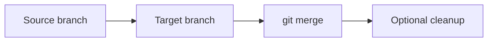
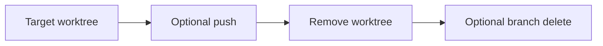
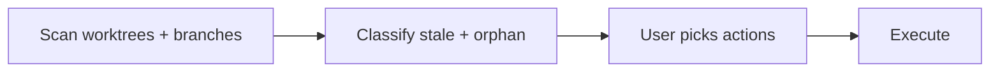
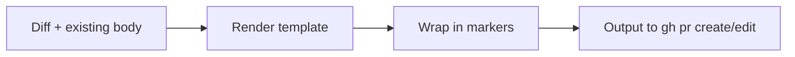
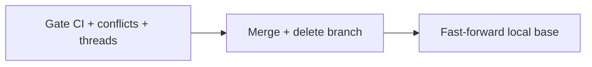
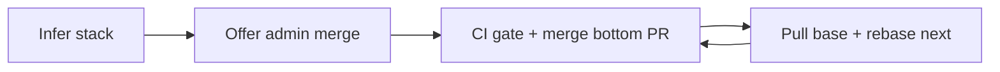

# empire-git

Git workflow skills: parallel worktree lifecycle, PR description templating, and gated PR merging.

Part of the [empire](../../README.md) marketplace.

## Install

```sh
/plugin marketplace add marcoskichel/empire
/plugin install empire-git@empire
```

Or install the full empire bundle (which includes this plugin):

```sh
/plugin install empire@empire
```

## Use with Codex

These skills run in OpenAI Codex (and other [Agent Skills](https://agentskills.io) runtimes). Install with [skills.sh](https://skills.sh):

```sh
npx skills add marcoskichel/empire -a codex
```

Codex invokes skills flat (`/worktree-open`, `$worktree-close`), so the `/empire-git:` command examples below are the Claude Code form. The bundled `worktree-setup.sh` and `worktree-registry.sh` ship inside each skill; Claude Code resolves them via `${CLAUDE_PLUGIN_ROOT}`, other agents via the skill's own `scripts/` directory. Worktrees still live under `.claude/worktrees/`.

## Skills

### `worktree-open`

Create or reopen an isolated git worktree for parallel development. Derives a deterministic path from the branch name (so the same branch always maps to the same worktree), copies `.env*` files, runs the matching dependency install, and prints the path so you can launch a Claude Code session or VSCode window in it.

**Triggers:** "open a worktree", "spin up a branch", "work on X separately", "in parallel", "start a parallel task", "isolated environment for an agent", "side branch without switching".

**Usage:** `/empire-git:worktree-open [branch | task description] [--base <branch>]`


**Source:** [`skills/worktree-open/SKILL.md`](skills/worktree-open/SKILL.md), [`scripts/worktree-setup.sh`](scripts/worktree-setup.sh)

### `worktree-list`

Read-only inventory of active worktrees with branch, dirty/clean status, ahead/behind counts, last commit, and staleness. Never modifies anything.

**Triggers:** "list worktrees", "show my worktrees", "what worktrees do I have", "what's in flight", "any forgotten worktrees", "stale worktrees".

**Usage:** `/empire-git:worktree-list [--stale]`


**Source:** [`skills/worktree-list/SKILL.md`](skills/worktree-list/SKILL.md)

### `worktree-merge`

Fold one worktree's branch into another local branch using `git merge` (defaults to `--no-ff`). Useful for batching small fixes into one branch before opening a single PR, or folding sub-feature branches back into a parent.

**Triggers:** "merge this worktree into X", "fold sub-branches back", "combine worktree branches", "merge feat/X into main locally".

**Usage:** `/empire-git:worktree-merge <branch> --into <target> [--no-close] [--ff]`



**Source:** [`skills/worktree-merge/SKILL.md`](skills/worktree-merge/SKILL.md)

### `worktree-close`

Finish work in a single worktree: optional push, remove the worktree, and let you choose whether to delete the branch. Uses safe delete (`git branch -d`) to flag unmerged work.

**Triggers:** "close this worktree", "I'm done with this worktree", "wrap up this branch", "push and remove", "tear down this worktree".

**Usage:** `/empire-git:worktree-close [branch] [--push] [--discard] [--force]`



**Source:** [`skills/worktree-close/SKILL.md`](skills/worktree-close/SKILL.md)

### `worktree-cleanup`

Batch housekeeping: scan for stale worktrees and orphaned branches, classify them (stale, missing, merged orphan, remote deleted, has open PR), then let you pick what to clean up. `--dry-run` previews without changes.

**Triggers:** "stale worktrees", "orphan branches", "prune worktrees", "clean up old branches", "purge stale worktrees", "housekeeping".

**Usage:** `/empire-git:worktree-cleanup [--dry-run] [--days N]`



**Source:** [`skills/worktree-cleanup/SKILL.md`](skills/worktree-cleanup/SKILL.md)

### `worktree-help`

Natural-language FAQ for the worktree toolkit. Answers questions about VSCode integration, port offsets, env file handling, dependency installs, and typical workflows. With no arguments, prints the overview.

**Triggers:** "how do I open this in VSCode", "why is .env copied", "what about port collisions", "worktree workflow", "show me the worktree FAQ".

**Usage:** `/empire-git:worktree-help [question]`


**Source:** [`skills/worktree-help/SKILL.md`](skills/worktree-help/SKILL.md)

### `worktree-registry.sh` (helper script)

Per-session JSON registry of worktrees opened by the current Claude Code session. `worktree-open`, `worktree-close`, `worktree-merge`, and `worktree-cleanup` maintain it automatically; external tooling (e.g. a tmux keybind that opens nvim in the active worktree) can read it directly.

**Storage:** `~/.claude/sessions/$CLAUDE_CODE_SESSION_ID/active-worktrees.json`

**Schema:**

```json
{
  "session_id": "<uuid>",
  "updated_at": "<UTC ISO-8601>",
  "worktrees": [
    {
      "branch": "feat/auth",
      "path": "/abs/path/to/worktree",
      "base": "main",
      "repo_root": "/abs/path/to/main/repo",
      "created_at": "<UTC ISO-8601>",
      "opened_at": "<UTC ISO-8601>"
    }
  ]
}
```

The `worktrees` array is always sorted ascending by `created_at`. `opened_at` refreshes when a worktree is reopened; `created_at` is immutable.

**Subcommands:**

```bash
bash plugins/empire-git/scripts/worktree-registry.sh add <branch> <path> --base <base> --repo-root <root>
bash plugins/empire-git/scripts/worktree-registry.sh remove <path>
bash plugins/empire-git/scripts/worktree-registry.sh list [--json]
bash plugins/empire-git/scripts/worktree-registry.sh prune
bash plugins/empire-git/scripts/worktree-registry.sh has <path>
```

**External discovery example (tmux + nvim):**

```bash
# Resolve the active Claude session's worktrees, then pick one with fzf
pane_pid=$(tmux display-message -p '#{pane_pid}')
claude_pid=$(pgrep -P "$pane_pid" claude | head -1)
sid=$(ps eww -p "$claude_pid" -o command= 2>/dev/null \
  | tr ' ' '\n' | sed -n 's/^CLAUDE_CODE_SESSION_ID=//p' | head -1)
wt=$(jq -r '.worktrees[].path' "$HOME/.claude/sessions/$sid/active-worktrees.json" | fzf)
[ -d "$wt" ] && tmux new-window -c "$wt" nvim
```

**Source:** [`scripts/worktree-registry.sh`](scripts/worktree-registry.sh)

### `pr-description`

Canonical PR description template. Senior-dev voice, direct and concise: no trivia, a few sentences total, ≤200 words. A `## TLDR` (1–2 sentences) opens any description longer than a couple of lines. Default sections: Why, What changed (behavior only, most important only), Test plan (omit for simple/hard-to-test diffs; never CI steps) — plus an extra section only when the change carries something a reviewer must not miss (breaking change, migration, new env var/dep, rollback, security note). Sets the author as assignee (`--assignee @me`) and maps the change to the repo's existing labels via `gh label list` (never invents labels unless an issue-tracker agents file defines the allowed set). Idempotent `<!-- pr-description:start/end -->` markers so user-added content (screenshots, `Fixes #N`, task lists) survives updates. Uses `CONTEXT.md` vocabulary for domain terms if present. Output goes to stdout for the caller to pipe into `gh pr create --body-file -` or `gh pr edit --body-file -`.

**Triggers:** "PR description", "PR body", "pull request description", "PR summary", "PR template", "GitHub PR body", "draft a PR", "write the PR", "summarize this branch for review", "regenerate PR body".



To make it impossible for the agent to bypass, add this one-line rule to your project or user CLAUDE.md:

```
- Before any `gh pr create --body*` or `gh pr edit --body*`, MUST invoke the `pr-description` skill and use its output verbatim.
```

**Source:** [`skills/pr-description/SKILL.md`](skills/pr-description/SKILL.md)

### `pr-comment-reply`

Canonical reply template for PR review comments. Human teammate voice: 1–2 short sentences, outcome only (what changed, why nothing changed, or the answer). No trivia, no thanks, no filler, no dashes as connectors, no semicolons, no jargon beyond what the comment uses. Covers five reply shapes (fixed, not changing, answering, deferring, comment is wrong/stale) with examples and anti-patterns. Output is plain text the caller posts to GitHub unchanged.

**Triggers:** "PR comment reply", "review comment reply", "reply to this comment", "respond to this review comment", "answer the reviewer", "reply on the PR thread", "draft a reply", "post a reply on the PR".

**Source:** [`skills/pr-comment-reply/SKILL.md`](skills/pr-comment-reply/SKILL.md)

### `pr-review-post`

Posts a GitHub PR review (verdict + summary + inline comments) in one atomic API call. The caller supplies the confirmed event and comment list; this skill owns the mechanics: resolving `OWNER/REPO` from the PR's own base repo, re-fetching the head SHA right before posting (warning on drift), anchoring comments to diff lines (`side`, spans, folding out-of-diff findings into the summary), building the payload safely with `jq --arg` (never string interpolation), and retrying once anchors or SHA go stale (max 2, never splitting into multiple posts). Used by `socratic-pr-review` and any agent that needs to submit a review.

**Triggers:** "post the review", "submit the review", "publish the review comments", "approve this PR", "request changes on the PR", "leave a review".


**Source:** [`skills/pr-review-post/SKILL.md`](skills/pr-review-post/SKILL.md)

### `pr-merge`

Gates then merges a single PR. Verifies CI is green (investigates and attempts a fix when red), rebases and resolves conflicts when the branch is behind, triages unresolved review threads intelligently (resolve, fix, or ask — never blind-blocks), then merges and deletes the head branch. Fast-forwards the local base checkout (e.g. updates `master`) when it's checked out in a worktree.

**Triggers:** "merge this PR", "merge the PR", "land this", "ship this PR", "merge when green".

**Usage:** `/empire-git:pr-merge [--pr <number>] [--squash|--merge|--rebase] [--admin]`



**Source:** [`skills/pr-merge/SKILL.md`](skills/pr-merge/SKILL.md)

### `pr-merge-stack`

Merges a stack of dependent PRs bottom-up. Infers the stack from conversation (asks when it can't), offers admin merge once up front (skips review requirements — CI stays a hard gate), then loops: wait for green CI, squash-merge, pull the base, `rebase --onto` the next PR (never plain-rebase after a squash merge), force-with-lease push, repeat until the stack is empty.

**Triggers:** "merge the stack", "merge pr stack", "land the stack", "merge all these PRs", "merge the chain", "ship the whole stack".

**Usage:** `/empire-git:pr-merge-stack [pr numbers or branches, bottom to top] [--admin]`



**Source:** [`skills/pr-merge-stack/SKILL.md`](skills/pr-merge-stack/SKILL.md)

## Upstream attribution

Source and license: [`skills/NOTICE.md`](skills/NOTICE.md).
