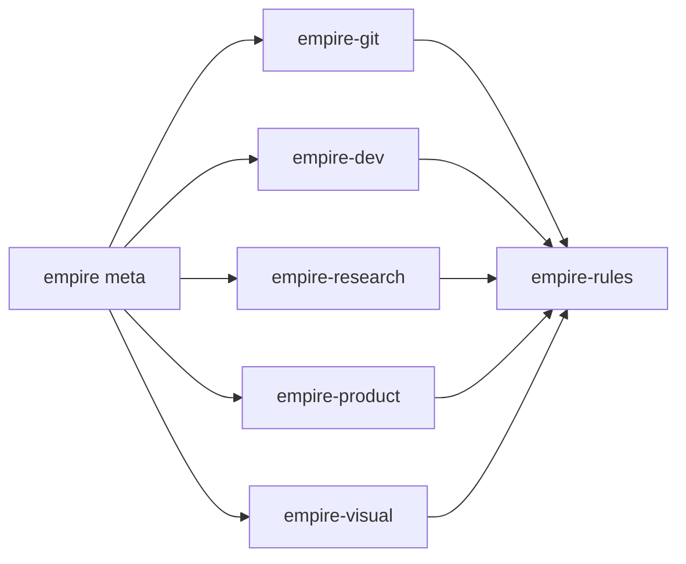

# empire (meta)

Bundle plugin: installs the full empire skill suite in one shot.

Part of the [empire](../../README.md) marketplace. This plugin contributes no skills of its own — it declares the five functional plugins as dependencies and Claude Code installs them automatically.

## Install

```sh
/plugin marketplace add marcoskichel/empire
/plugin install empire@empire
```

Want a subset? Install any sub-plugin individually instead:

```sh
/plugin install empire-git@empire
/plugin install empire-dev@empire
/plugin install empire-research@empire
/plugin install empire-product@empire
/plugin install empire-visual@empire
```

## Bundled plugins

| Plugin                                            | Purpose                                                                                         |
| ------------------------------------------------- | ----------------------------------------------------------------------------------------------- |
| [`empire-git`](../empire-git/README.md)           | Worktree lifecycle (`open`, `close`, `merge`, `list`, `cleanup`, `help`) and `pr-description`   |
| [`empire-dev`](../empire-dev/README.md)           | Code `team-review` skill plus 11 bundled dev subagents (code review, paradigms, domain experts) |
| [`empire-research`](../empire-research/README.md) | `explore` (open-ended) and `compare` (closed) research skills with parallel agent dispatch      |
| [`empire-product`](../empire-product/README.md)   | `pitch`, `vet` (idea pressure-test), `recon` (competitor matrix) plus three bundled subagents   |
| [`empire-visual`](../empire-visual/README.md)     | `visual-first` output style + on-demand `visualize` skill for terminal-native ASCII diagrams    |

`empire-rules` is auto-installed as a transitive dependency of every sub-plugin and provides `/empire-rules:sync-rules` for wiring routing snippets into your `AGENTS.md` or `~/.claude/CLAUDE.md`.


