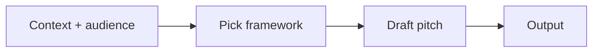
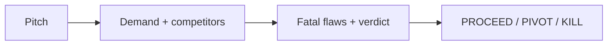
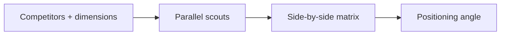
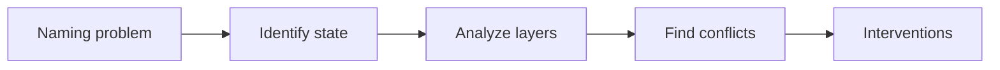

# empire-product

Product communication and intelligence: pitches, idea validation, competitor mapping, and naming. Four skills, three bundled subagents.

Part of the [empire](../../README.md) marketplace.

## Install

```sh
/plugin marketplace add marcoskichel/empire
/plugin install empire-product@empire
```

Or install the full empire bundle (which includes this plugin):

```sh
/plugin install empire@empire
```

## Skills

### `pitch`

Generate elevator pitches for repos or people. Detects mode (repo vs personal), reads project context (`package.json`, `README.md`, recent commits) when pitching a repo, asks for the gaps it can't infer (audience, format, proof points), and produces a one-liner, a 30-second spoken version, or a longer context-specific pitch.

**Triggers:** "elevator pitch", "pitch this project", "introduce myself", "personal pitch", "how do I pitch myself", "pitch for this repo", "tell me about yourself", "describe this project", "intro paragraph", "tagline", "one-liner", "GitHub repo description", "what does this do".



**Source:** [`skills/pitch/SKILL.md`](skills/pitch/SKILL.md)

### `vet`

Pressure-test a product idea with brutal honesty. Default stance is skeptical: assume a fatal flaw until evidence proves otherwise. The skill confirms the pitch and assumptions, automatically invokes `/empire-product:recon` when competitors are provided (feeding its matrix directly into the Competitor Teardown section), then dispatches a validator agent under web-search preconditions. Produces a structured report with demand signals, competitor teardown, fatal flaws, risks, and a `PROCEED / PIVOT / KILL / INSUFFICIENT_DATA` recommendation. Confidence-tagged.

**Triggers:** "vet idea", "validate idea", "go no go", "pressure test", "is this idea good", "kill the idea", "should I build this", "fatal flaw check", "stress test the idea", "brutal honesty on this idea".



**Source:** [`skills/vet/SKILL.md`](skills/vet/SKILL.md)

### `recon`

Map the competitive landscape across the dimensions that matter for a positioning or product decision. Dispatches one agent per competitor in parallel, scoped to publicly available info only (no social engineering). Consolidates a side-by-side matrix with `[Confirmed]` / `[Estimated]` / `[Inferred]` tags and `As of` dates, calls out gaps, and suggests a positioning angle.

**Triggers:** "competitor analysis", "compare competitors", "competitor matrix", "competitor research", "feature gap", "scout competitors", "size up competition", "pricing comparison vs competitors", "positioning analysis", "competitive landscape".



**Source:** [`skills/recon/SKILL.md`](skills/recon/SKILL.md)

### `mint`

Diagnose why names don't work and guide creation of names that do. Covers five failure states (feels wrong, disjointed family, forgettable, wrong signals, practical failures) and four alignment layers (sound, meaning, cultural, functional). Works for brand names, product names, skill names, character names, place names, and titles. Sequential phased process for brand/product; diagnostic states for quick naming. Findings stay local.

**Triggers:** "name this", "this name doesn't feel right", "brand naming", "product naming", "names don't match", "forgettable name", "wrong associations", "mint a name", "/empire-product:mint".



**Source:** [`skills/mint/SKILL.md`](skills/mint/SKILL.md)

## Bundled agents

| Agent                    | Use                                                           |
| ------------------------ | ------------------------------------------------------------- |
| `project-idea-validator` | Brutal go/no-go pressure-testing of ideas (anchor for `vet`)  |
| `competitive-analyst`    | Vendor / competitor / option comparisons (anchor for `recon`) |
| `market-researcher`      | Market sizing, audience research, trend analysis              |

All three skills auto-discover whatever specialist subagents are installed. If your environment has more specialized subagents from another marketplace, the skills will use them.

## Upstream attribution

- Bundled agents: [`agents/NOTICE.md`](agents/NOTICE.md)
- Bundled skills: [`skills/NOTICE.md`](skills/NOTICE.md)
