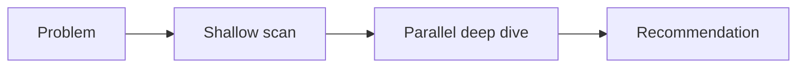
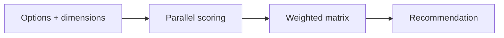

# empire-research

Research collaboration: open-ended exploration, closed comparison, and claim investigation — with workflow-backed parallel agent dispatch and consolidated reports. Three skills, one bundled subagent.

Part of the [empire](../../README.md) marketplace.

## Install

```sh
/plugin marketplace add marcoskichel/empire
/plugin install empire-research@empire
```

Or install the full empire bundle (which includes this plugin):

```sh
/plugin install empire@empire
```

## Skills

### `explore`

Open-ended approach exploration. Use when the solution space is open: you know the problem, not the options. The skill confirms the problem, dispatches a shallow scan to enumerate 3–5 candidate approaches, lets you pick a subset to deep-dive, then fans out one researcher per approach via the `explore-deepdive` workflow (inline parallel agents when the Workflow tool is unavailable), and produces a consolidated report with a recommended direction. Findings stay local — never posted externally.

**Triggers:** "explore options", "what could we do for X", "research approaches", "investigate approaches", "spawn research team", "what are the options", "options analysis", "explore solutions", "have the team explore".



**Source:** [`skills/explore/SKILL.md`](skills/explore/SKILL.md)

### `compare`

Closed comparison of a known set of options head-to-head. Use when you already have options A, B, C and want a side-by-side matrix. The skill confirms the option list and decision dimensions, scores each option in isolation via the `compare-score` workflow (inline parallel agents when the Workflow tool is unavailable), and consolidates a weighted matrix with a winner, runner-up criteria, and caveats. Confidence-tagged data. Findings stay local.

**Triggers:** "compare libs", "compare frameworks", "evaluate options", "side by side", "head to head", "X vs Y", "which is better", "tooling comparison", "weigh these options", "decide between these".



**Source:** [`skills/compare/SKILL.md`](skills/compare/SKILL.md)

### `dissect`

Systematically investigate complex claims by decomposing them into atomic verifiable components, resolving vague entities, verifying each independently, and separating confirmed facts from narrative interpretation. Use for multi-part assertions or narratives that mix facts with framing. Confidence-tagged. Findings stay local.

**Triggers:** "investigate this claim", "fact-check this", "is this true", "decompose this narrative", "viral content check", "trace this claim", "/empire-research:dissect".

**Source:** [`skills/dissect/SKILL.md`](skills/dissect/SKILL.md)

## Workflows

`explore` and `compare` drive their parallel fan-out through bundled [dynamic workflows](https://code.claude.com/docs/en/workflows) when the Workflow tool is available, invoked via `Workflow({ scriptPath: "${CLAUDE_PLUGIN_ROOT}/workflows/<name>.js" })`. When the tool is unavailable, both skills fall back to inline parallel agent dispatch.

| Workflow              | Driven by | Does                                                            |
| --------------------- | --------- | --------------------------------------------------------------- |
| `explore-deepdive.js` | `explore` | One researcher per selected approach → structured pros/cons/fit |
| `compare-score.js`    | `compare` | One scorer per option, blind to rivals → per-dimension scores   |

## Bundled agents

| Agent              | Use                                                   |
| ------------------ | ----------------------------------------------------- |
| `research-analyst` | Multi-source research synthesis, broad info retrieval |

The skills auto-discover whatever specialist subagents are installed and pick the best match per task. If your environment has more specialized subagents from another marketplace, the skills will use them.

## Upstream attribution

- Bundled agents: [`agents/NOTICE.md`](agents/NOTICE.md)
- Bundled skills: [`skills/NOTICE.md`](skills/NOTICE.md)
